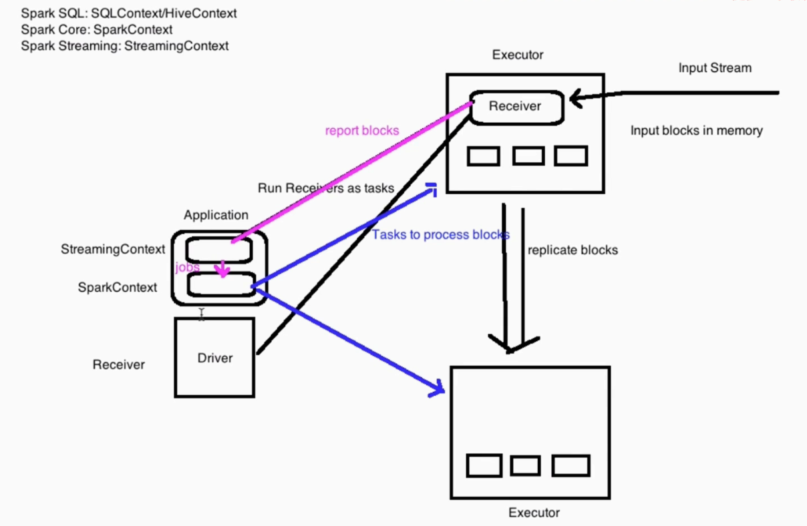
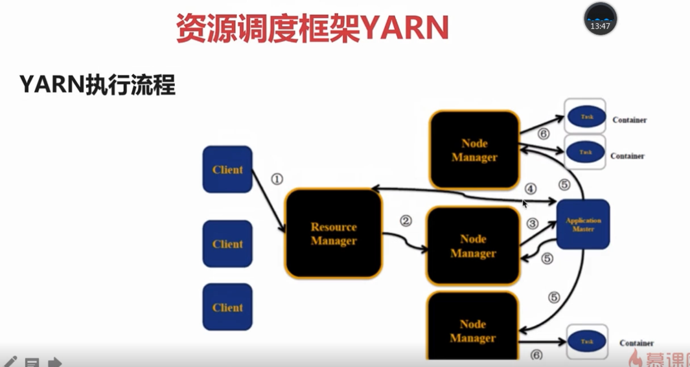
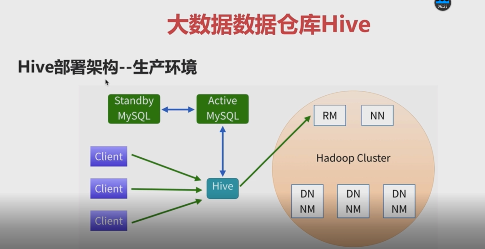

# Hadoop 学习

## spark 工作原理图



## hadoop的定义
> 狭义：是一个适合大数据分布式存储（HDFS）分布式计算（MapReduce）和资源调度（Yarn）的平台
> 广义：hadoop生态，由多个小系统组成。Hbase,hive,R，mahout,pig等  

> hadoop优点：
* 源码开源，可以做特性开发，适配项目需求
* 社区活跃
* 涉及分布式存储和计算的方面：flume 进行数据采集、spark/MR/Hive数据处理、HDFS/Hbase 数据存储

> hdfs缺点
* 不适合小文件存储 
* 延迟高


## 机器参数设置
* 生成ssh   ssh-keygen -t rsa -C "youremail@example.com"
* 配置ssh 免密登陆  
    cp ~/.ssh/id_rsa.pub ~/.ssh/authorized_keys  自己登陆自己免密，用于进程重
    cat id_rsa.pub >> ~/.ssh/authorized_keys  追加的方式
    启后免密登陆
* 修改主机名   
    /etc/sysconfig/network  重启生效（centos 6.4）
    hostname hadoop001  立即生效
* ip和hostname 的映射关系  /etc/hosts  


## hadoop配置修改
* etc/hadoop/hadoop-env.sh 
    `export JAVA_HOME=/usr/java/latest `
* hadoop/etc/hadoop/cor-site.xml
    ```
    <property>
        <name>fs.defaultFS</name>
        <value>hdfs://hadoop001:8020</value>
    </property>

    <property>  临时目录
        <name>hadoop.tmp.dir</name>
        <value>~/app/tmp</value>
    </property>
    ```
* hdfs-site.xml 副本系数
    ```
    <property>
        <name>dfs.replication</name>
        <value>1</value>
    </property>
    ```

* mapred-site.xml  启动yarn的配置文件
    ```
        <property>
            <name>mapreduce.framework.name</name>
            <value>yarn</value>
        </property>
    ```
* yarn-site.xml
    ```
     <property>
        <name>yarn.nodemanager.aux-services</name>
        <value>mapreduce_shuffle</value>
    </property>
    ```

## 格式化HDFS（只执行一次）

* bin/hdfs namenode -format
* sbin/start-dfs.sh

* sbin/start-yarn.sh  启动yarn

* 浏览器 http://hadoop001:50070  这里不是5020

    http://hadoop001:8088 yarn管理页面
## hdfs 命令
* hdfs fs -mkidr /data
* hdfs fs -ls /
* hdfs fs -mkdir -p /a/b   递归创建目录
* hdfs fs -ls -R /   递归显示/  下的文件
* hdfs fs -put xx.txt  /data/  上传文件


 ## yarn 架构

 ### ResourceManager
 ### nodeManager
 ### applicationMaster

 一个作业对应一个application task
 


 ### yarn   web默认端口8088
 ### yarn 提交作业
 > hadoop jar xxx.jar inputPath  outputPath

 ## hive 基本概念
 >  APACHE HIVE TM
    The Apache Hive ™ data warehouse software facilitates reading, writing, and managing large datasets residing in distributed storage using SQL. Structure can be projected onto data already in storage. A command line tool and JDBC driver are provided to connect users to Hive.
 > hive 底层执行引擎有，mapreduce,tez,spark。hive本身不是数据库，而是数据集，用来处理分布式的数据。hbase 才是大数据中的数据库。

 > hive 配置文件  hive/confi/hive-site.xml  同时在lib目录下添加mysql的驱动文件

    <property>
        <name>javax.jdo.option.ConnectionURL</name>
        <value>jdbc:mysql://localhost:3306/sparksql?createDatabaseIfNotExist=true</value>
    </property>

    <property>
        <name>javax.jdo.option.ConnectionDriverName</name>
        <value>com.mysql.jdbc.Driver</value>
    </property>

    <property>
        <name>javax.jdo.option.ConnectionUserName</name>
        <value>root</value>
    </property>

    <property>
        <name>javax.jdo.option.ConnectionPassword</name>
        <value>root</value>
    </property>


 > hive部署结构，一个节点部署hive就可，原数据存储在mysql，需要主备
 


 > hive 创建一个表，可以从外部导入数据
 ```
    CREATE TABLE u_data (
    userid INT,
    movieid INT,
    rating INT,
    unixtime STRING)
    ROW FORMAT DELIMITED
    FIELDS TERMINATED BY '\t'
    STORED AS TEXTFILE;
 ```
 > 从外部文件导入数据到hive表中
 ```
    LOAD DATA LOCAL INPATH 'xxxx/u.data' OVERWRITE INTO TABLE u_data;
 ```

> hive可以和py文件一起使用，用来处理数据更加方便
* [hive 入门官方文档](https://cwiki.apache.org/confluence/display/Hive/GettingStarted#GettingStarted-CreatingHiveTables)
* [hive DML 官方文档](https://cwiki.apache.org/confluence/display/Hive/LanguageManual+DML#LanguageManualDML-Loadingfilesintotables)


## spark 编译
[spark编译官方文档](http://spark.apache.org/docs/latest/building-spark.html)

> ./build/mvn -Pyarn -Phadoop-2.7 -Dhadoop.version=2.7.3 -Phive -Phive-thriftserver -DskipTests clean package

注意观察，源码中的pom.xml文件，其中有默认版本配置

使用make-distribute.sh 编译可执行的包，一定要看文档

standalone 模式配置， spark-shell --master local[2]是运行在本地，
配置了spark standalone集群后，就可以运行在集群上了

> mvn 中的 -D 开始的参数为指定版本号  -P开始的参数为制定profile内容

> 自己编译的命令  ./dev/make-distribution.sh --name 2.2.0-ldy --tgz -Phadoop-2.6 -Pyarn -Phive -Dhadoop.version=2.6.0-cdh5.7.0 -Dhive.version=1.1.0-cdh5.7.0 -Phive-thriftserver -DskipTests clean package

> spark standalone模式，类似hadoop 环境搭建，有master和worker节点
需要配置：spark-env.sh  slaves 文件