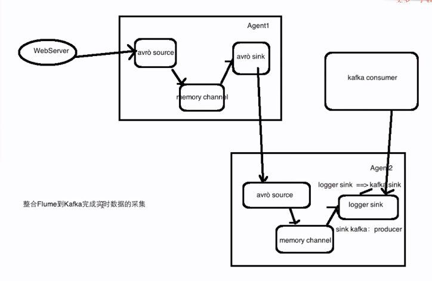

# 这里记录sparkstream 的学习笔记
## 运行kafka ，需要配置zookeeper
* 配置zookeeper的文件目录
* 配置kafka 
    > broker.id = 0  这个地址必须唯一
    > listeners  监听的端口   PLAINTEXT://:9093
    > host.name  服务器地址
    > log.dirs   日志目录
    > zookeeper.connect  链接zk的地址

```
启动顺序：
单节点多broker
kafka 一个配置文件（config/server.properties）一个broker,一个节点上可以起多个broker

后台启动：bin/kafka-server-start.sh -daemon ../config/server.properties &

jps -m 查看进程的启动脚本，可以分辨服务名相同的进程


创建topic -> zookeeper   bin/kafka-topics.sh --create --zookeeper hadoop000:2181 --replication-factor 1 --partitions 1 --topic test


生产消息 -> broker  (kafka)  bin/kafka-console-producer.sh --broker-list hadoop000:9092 --topic test
如果是多个broker  bin/kafka-console-producer.sh --broker-list hadoop000:9092,hadoop000:9093,hadoop000:9094 --topic test

注意：生产消息报“Failed to update metadata after 6000ms” 这里检查生产消息的端口号是否正确 

消费消息  ->zookeeper   bin/kafka-console-consumer.sh --zookeeper hadoop000:2181 --topic test --from-beginning (默认从当前位置，即消费新产生的)
注意：官网指定 --bootstrap-server  是一个bug


查看kafka 所有topic 详细信息 --(分区、副本)
kafka-topics.sh --describe --zookeeper hadoop000:2181

查看制定topic的详细信息
kafka-topics.sh --describe --zookeeper hadoop000:2181 --topic hello_topic

查看副本和分区信息时，当有多个broker时候会有一个leader broker，  
Partition:0  在第0个分区
PartitionCount: 1  代表分区总数
Replicas：3,1,2  副本数
Isr:3，1,2 代表活跃节点


```

## flume-kafka-spark整合架构图


## flume的启动脚本, 注意不同版本配置文件中所制定的配置文件名可能不一样，eg：flume 1.6 和1.7差别就很大
flume-ng agent --name exec-memory-avro --conf $FLUME_HOME/conf
--conf-file $FLUME_HOME/conf/exec-memory-avro.conf
-Dflume.root.logger=INFO,console

flume-ng agent --name avro-memory-kafka --conf $FLUME_HOME/conf
--conf-file $FLUME_HOME/conf/avro-memory-kafka.conf
-Dflume.root.logger=INFO,console

启动flume需注意，这里的--name 指定的为agent的name，为配置文件中指定的名称，否则会出错

注意：先启动后面的 flume 节点
bin/flume-ng agent --conf conf --conf-file conf/exec-memory-avro.conf --name exec-memory-avro -Dflume.root.logger=INFO,console

bin/flume-ng agent --conf conf --conf-file conf/avro-memory-kafka.conf --name avro-memory-kafka -Dflume.root.logger=INFO,console


注意：配置flume文件时候，在连接 source和sink时候有一个是channels 一个是channel,即，sink所链接的channel只能有一个，但是source连接的channel可以为多个。


## 关于kafka和zk的不错的总结
[kafka-flume-zk总结](https://blog.csdn.net/sniperken/article/details/52636675?utm_source=blogxgwz3)


## spark-submit 使用
> 使用spark-submit 来提交spark 运行程序，提供jar即可以运行再服务器上 --(生产环境)
* ./spark-submit --master local[2] --class className  --name  applicationName   jarPath

> 使用spark-shell 来提交 --(测试使用)  写代码再shell用运行


## 工作原理
> 细粒度 

> 粗粒度工作原理
spark streaming 接受到实时数据流，把数据按照制定的时间段，切成一小片片的数据块，然后把小的数据块传给spark engine 进行处理，输出

## sparkStreaming  
```
StreamingContext -- sparkStreaming 的入口
SparkContext--spark-shell 默认维护的一个对象

val conf = new SparkConf().setMaster("local[2]").setAppName("NetworkWordCount")
val ssc = new StreamingContext(conf, Seconds(1))

通过sparkConf生成一个sparkContext

1.streamingContext 一旦启动，新的流式计算不能被设置，或者是增加
2.context 一旦被stop ，不能够被restart，隐藏含义就是只能重新运行 start
3.一个jvm中同时只能有一个streamingContext
4.streamingcontext 停止了 stop(), 那么sparkContext也就停止了。可以stop(stopSparkContext=false),这样sparkContext就不会停止
5.sparkContext 可以用来创建多个streamingContext,只要前一个streamingContext停止就行
```

## DStream  
> a DStream is represented by a continuous series of RDDs, which is Spark’s abstraction of an immutable, distributed dataset. Each RDD in a DStream contains data from a certain interval.
对Dstream 操作算子，eg：map/flatMap, 其底层是对Dstream中的每个RDD做该算子操作。因为Dstream是由一些列不同的RDD组成。

## Input DStreams and Receivers
> Every input DStream (except file stream, discussed later in this section) is associated with a Receiver (Scala doc, Java doc) object which receives the data from a source and stores it in Spark’s memory for processing.
```
每个input DStream 都会关联一个receiver，除了file Stream.  fileStream 直接返回一个Dstream,  其他inputDstream 返回的是ReceiverInputDstream.


local[n]  确保n>number of receivers,  n代表线程个数，receiver会占用一个线程。文件系统不需要receiver，这时候receiver = 0 
```


## Transformations on DStreams
> Similar to that of RDDs, transformations allow the data from the input DStream to be modified.
```
eg:
map(func) 	Return a new DStream by passing each element of the source DStream through a function func.
flatMap(func) 	Similar to map, but each input item can be mapped to 0 or more output items. 
```

## Output Operations on DStreams
> Output operations allow DStream’s data to be pushed out to external systems like a database or a file systems. 

eg：
print(),saveAsTextFiles(),foeachRDD()


## 窗口函数的概念
```
Spark Streaming also provides windowed computations, which allow you to apply transformations over a sliding window of data。

    window length - The duration of the window (3 in the figure).
    sliding interval - The interval at which the window operation is performed (2 in the figure).
```
通俗点说：
就是窗口函数可以一次处理几个批次的数据，对应几个rdd，包含两个参数，窗口长度、滑动距离。
应用场景：每个10s计算前30s的数据，这里10s为sliding interval,30s为window length.

这一这里的倍数关系，否则会异常， 两个参数 = n * batch size 


政通遗留问题：
1.specialVehicle 好像没有使用缓存，这个可以优化一下后台，除了分页查询的接口，别的都可以走缓存的。
2.换班申请只有指定的三个人才可以，目前是所有人都可以审批，这个忘了做限制了。
3.数据库建立各种索引优化sql性能，最低标准 type = range 级别，具体参考阿里巴巴数据库索引归约。


## 使用Dstream 的transform函数可以把 一个Rdd应用到一个Dstream上，做类似黑名单的处理。

## flume 于spark 整合，有两种方式，
> push 先启动sparkstreaming 然后启动flume
> pull (常用):这种方式更可靠，保证数据不丢失。 先启动flume,然后启动sparkstreaming


## telnet 和nc -lk ，ping
> ping通常是用来检查网络是否通畅或者网络连接速度的命令。而telnet是用来探测指定ip是否开放指定端口的
> nc -lk 999 功能更加强大，可以用来传输数据，但是会占用一个端口
> telnet localhost 999 连接指定ip和端口，不会占用端口，也可以用来发数据


总结：
>窗口函数用来处理，每10秒钟用来统计一次最近30分钟，单词出现的次数。特点：重复，sparkstreaming 本身就是每batchsize(5s)中统计一次,倍数关系。
> 今天到现在位置，课程的访问量，使用的是updateStateByKey. 特点：一段时间，不重复、


## 在spark-submit 提交作业的时候，可能会需要指定很多jar的名字，可以这样处理
> --jars $(echo /home/hadoop/app/hbase/lib/*.jar | tr ' ' ',') 
| 为管道
tr 为转换命令，echo的输出作为tr的输入，然后把空格转换为 ，